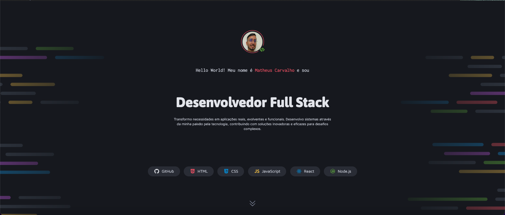

# Portfólio de Desenvolvedor - Matheus Carvalho

<div align="center">
  
  
  
</div>

<br />


> *Dica: Tire um print da tela inteira do seu site e salve como `cover-image.png` na pasta assets para a imagem acima aparecer.*

## 💻 Sobre o Projeto

Este é um projeto de **Portfólio Pessoal** desenvolvido para apresentar meus projetos, habilidades técnicas e informações de contato. O layout foi construído com foco em design moderno, responsividade e boas práticas de codificação.

O projeto foi baseado no desafio "Portfolio Dev" da comunidade Rocketseat, com personalizações próprias.

## 🔗 Acesse o Projeto Online

Você pode visualizar o projeto rodando através do GitHub Pages:

👉 **[Clique aqui para acessar o Portfólio](https://mc4rvalho.github.io/projeto-portfolio-dev/)**

---

## 🛠 Tecnologias Utilizadas

O projeto foi desenvolvido utilizando as seguintes tecnologias:

- **HTML5 Semântico:** Estruturação correta do conteúdo e acessibilidade.
- **CSS3 Moderno:**
  - **Flexbox & CSS Grid:** Para layouts responsivos e alinhamentos complexos.
  - **CSS Variables:** Para gerenciamento consistente de cores e fontes (`var(--color...)`).
  - **Media Queries:** Para adaptação em diferentes tamanhos de tela.
- **Git & GitHub:** Para versionamento e hospedagem do código.

## ✨ Funcionalidades Destacadas

- **Cards de Tecnologias:** Uso de máscaras CSS para aplicar cores dinâmicas nos ícones das stacks.
- **Links de Contato:** Botões interativos com efeitos de hover (mudança de cor da borda e ícones).
- **Seções Organizadas:** Header, Projetos, Serviços e Contato com espaçamentos fluidos.
- **Integração com E-mail:** Link direto `mailto:` configurado para melhor UX.

---

## 🚀 Como rodar o projeto localmente

Como este é um projeto estático, não há necessidade de instalação de dependências (como npm). Siga os passos abaixo:

1. **Clone o repositório:**
   Abra seu terminal e digite:
   ```
   bash
   git clone [https://github.com/mc4rvalho/projeto-portfolio-dev.git](https://github.com/mc4rvalho/projeto-portfolio-dev.git)
   ```
   
2. **Entre na pasta do projeto:**
  ```
  Bash
  cd projeto-portfolio-dev
  Abra o código: Se estiver usando o VS Code:
  ```

3. **Abra o código: Se estiver usando o VS Code:**
  ```
  Bash
  code .
  ```

4. **Visualize no navegador:**

Você pode simplesmente clicar duas vezes no arquivo index.html na pasta do projeto.

**Recomendado:** Use a extensão **Live Server** do VS Code para ver as alterações em tempo real. Clique com o botão direito no index.html e selecione "Open with Live Server".

📬 Contato
Feito por Matheus Carvalho. Entre em contato!

**LinkedIn:** Matheus Carvalho

E-mail: mcarvalho093@gmail.com

```
### O que você precisa fazer agora:

1.  **Crie o arquivo:** No seu VS Code, crie um arquivo chamado `README.md` na raiz do projeto.
2.  **Cole o código:** Cole o conteúdo acima.
3.  **Adicione a Capa (Opcional mas recomendado):**
    * Tire um print bonito do seu site pronto.
    * Salve na pasta `assets` com o nome `cover-image.png`.
    * Isso fará com que quem entre no seu GitHub veja a "cara" do site logo de início.
4.  **Atualize o Link do LinkedIn:** No final do código que te mandei, onde diz `SEU-LINK-AQUI`, coloque o final da URL do seu perfil.
5.  **Suba para o GitHub:**
    ```bash
    git add .
    git commit -m "Docs: Adiciona README profissional"
    git push
    ```
```
